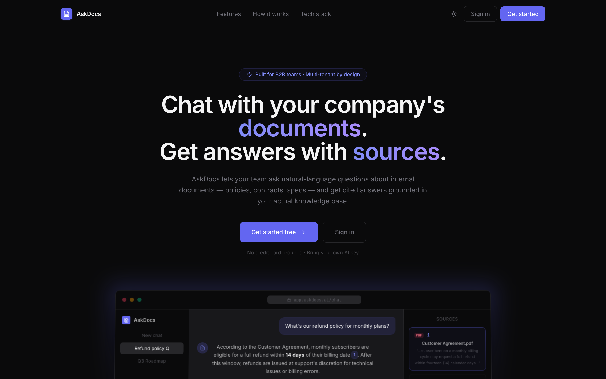
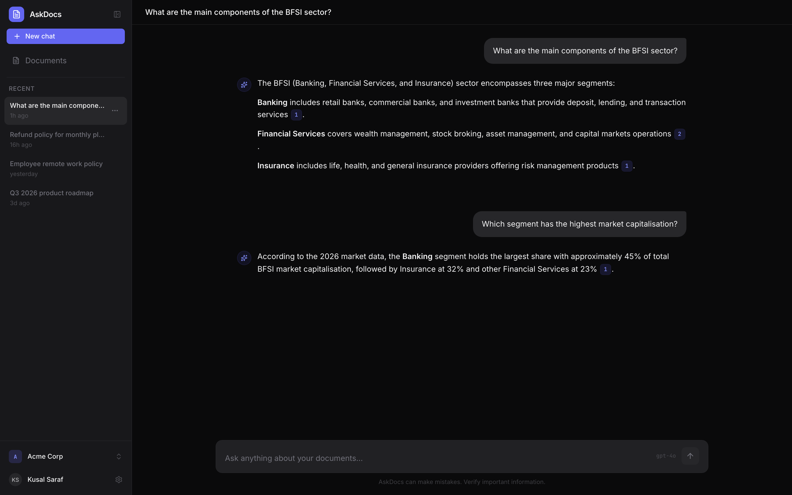
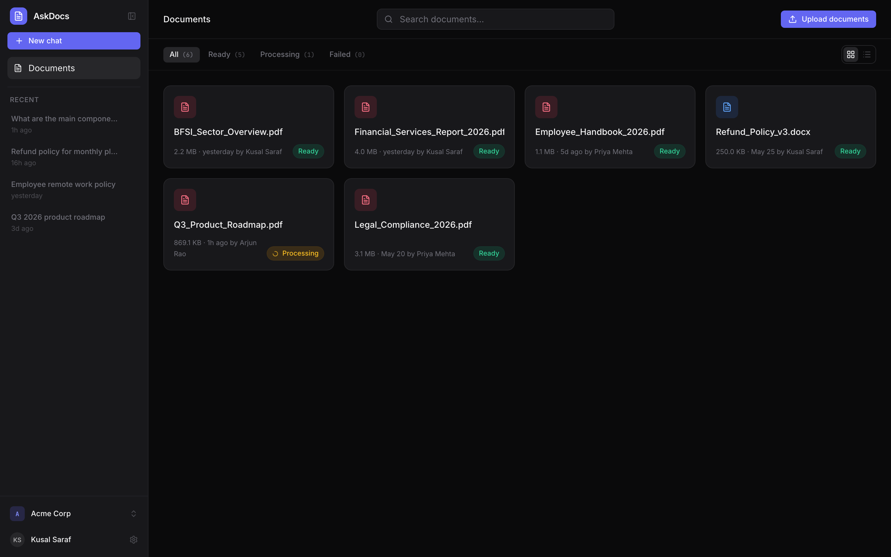
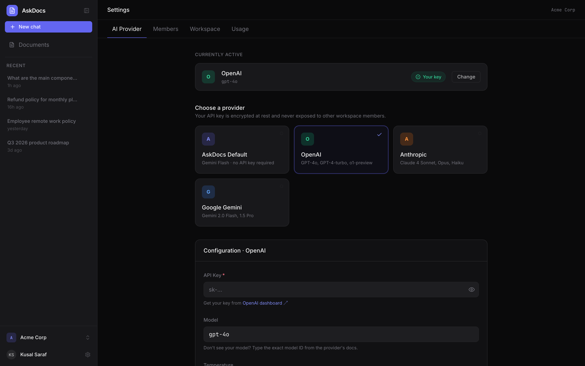
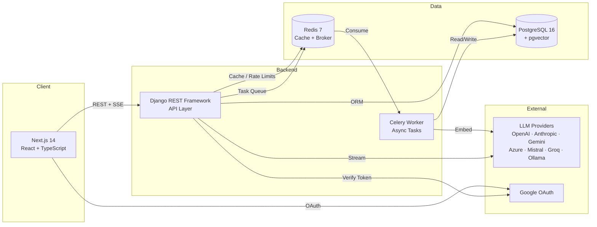

# AskDocs

*Multi-tenant document intelligence platform — upload your company's documents, chat with them, get cited answers grounded in your actual knowledge base.*

[](https://python.org)
[](https://djangoproject.com)
[](https://nextjs.org)
[](https://typescriptlang.org)
[](https://postgresql.org)
[](https://docs.celeryq.dev)
[](https://redis.io)
[](https://docker.com)
[](backend/tests/)

## Screenshots

<p align="center">
  
</p>

<p align="center">
  
</p>

<p align="center">
  
</p>

<p align="center">
  
</p>

> :link: **Live demo:** _Coming soon_ | :movie_camera: **Walkthrough:** _Coming soon_

---

## What is AskDocs?

AskDocs is a multi-tenant document intelligence platform for B2B teams. Upload PDFs, DOCX, or TXT files, and then ask natural-language questions — every answer is grounded in your actual documents with inline citations linking back to the exact source passages.

What makes it interesting technically: complete multi-tenant data isolation with role-based access, a Bring Your Own Key (BYOK) system supporting 7 LLM providers with encrypted key storage, an async ingestion pipeline (Celery + Redis → parse → chunk → embed → pgvector), RAG retrieval with cosine similarity and citation extraction, and real-time token streaming via Server-Sent Events.

This is a production-grade portfolio project demonstrating full-stack AI engineering — from database schema design and async task orchestration to streaming UX and defense-in-depth security patterns. Built as a single-developer project to production standards.

---

## Key Features

| Feature | Details |
|---------|---------|
| **Multi-tenant workspaces** | Complete data isolation, role-based access (Admin / Member / Viewer), workspace switching, email invitations with expiry |
| **Bring Your Own AI** | OpenAI, Anthropic, Gemini, Azure, Mistral, Groq, Ollama — encrypted key storage (Fernet), one-click provider switching, connection testing |
| **Async document ingestion** | Celery + Redis pipeline: parse (Unstructured.io / PyPDF) → chunk (token-bounded with overlap) → embed (OpenAI / Gemini) → store in pgvector |
| **RAG with inline citations** | Every answer cites exact source passages — click a citation to see the original text in context with page numbers |
| **Streaming responses** | Server-Sent Events stream tokens in real-time from any configured LLM provider |
| **Production auth** | Google OAuth, JWT with refresh token rotation, role-based permissions enforced on every endpoint |
| **Cost-aware by design** | Per-user daily rate limits, global platform budget caps, response caching (24h TTL), BYOK bypasses platform limits |

---

## Architecture



### How it works

**Upload a document:** The frontend uploads a file → the API validates it (size, MIME type, magic bytes) and creates a `Document` record → a Celery task picks it up asynchronously: parse with Unstructured.io (preserving tables, headings, lists) → split into token-bounded chunks with overlap → generate embeddings via OpenAI or Gemini → store chunks + vectors in pgvector with HNSW indexing → mark document as `ready`.

**Ask a question:** The user types a question → the API checks rate limits and budget → embeds the query → performs cosine similarity search against the workspace's document chunks → builds a RAG prompt with retrieved context and conversation history → streams the response token-by-token via SSE → extracts citation indices from the response → persists the message with source references → caches the response for identical future queries.

---

## Tech Stack

| Layer | Technology |
|-------|-----------|
| **Frontend** | Next.js 14, TypeScript 5, Tailwind CSS, shadcn/ui, TanStack Query |
| **Backend** | Django 5, Django REST Framework, Celery 5.4, Redis 7 |
| **Database** | PostgreSQL 16 + pgvector (HNSW index, cosine similarity) |
| **AI / ML** | Unstructured.io (document parsing), OpenAI / Anthropic / Gemini APIs, tiktoken |
| **Auth** | Google OAuth, JWT (SimpleJWT) with refresh rotation, django-allauth |
| **Infra** | Docker Compose (4-service stack), Gunicorn + Uvicorn |

---

## Project Structure

```
askdocs/
├── frontend/              → Next.js 14 app (TypeScript + Tailwind + shadcn/ui)
│   ├── app/
│   │   ├── (app)/         → Authenticated pages: chat, documents, settings
│   │   ├── (auth)/        → Sign-in with Google OAuth
│   │   └── invite/        → Invitation acceptance flow
│   ├── components/        → Reusable UI components (chat, documents, layout)
│   └── lib/               → API client, hooks, contexts, constants, utilities
├── backend/               → Django 5 REST API
│   ├── apps/
│   │   ├── accounts/      → Custom user model, Google OAuth verification
│   │   ├── workspaces/    → Multi-tenant workspaces, memberships, invitations
│   │   ├── documents/     → Upload, parse, chunk, embed pipeline
│   │   ├── chat/          → RAG retrieval, streaming LLM responses, citations
│   │   ├── providers/     → BYOK multi-provider LLM system with encryption
│   │   └── core/          → Shared utilities, permissions, exceptions, constants
│   ├── config/            → Django settings (base / development / production / testing)
│   └── tests/             → 166 tests across 25 modules
├── docs/                  → Project documentation and architecture overview
└── docker-compose.yml     → Full development stack (Postgres, Redis, API, Worker)
```

---

## Key Design Decisions

- **pgvector over Pinecone/Weaviate** — Keeps all data in one Postgres instance, enables transactional consistency between document metadata and embeddings, removes a managed service from the stack. HNSW indexing (`m=16`, `ef_construction=64`) provides sub-millisecond similarity search at the expected document scale.

- **Celery over synchronous ingestion** — Document ingestion takes 5–60 seconds (parse + chunk + embed). Synchronous processing would block the upload endpoint and timeout HTTP connections. Celery with Redis broker allows fire-and-forget uploads with real-time status polling.

- **Fernet symmetric encryption for API keys** — Industry-standard authenticated encryption (AES-128-CBC + HMAC-SHA256). The encryption key lives in environment variables, never in code or database. Keys are rotatable, and only the last 4 characters are ever exposed to the frontend for display.

- **Workspace-scoped data isolation enforced at three layers** — Permission classes gate endpoint access, queryset filtering ensures only workspace-owned data is returned, and denormalized `workspace_id` on child models (DocumentChunk, Message) prevents cross-tenant data leakage even if a queryset filter is missed. Defense-in-depth for multi-tenancy.

- **Unstructured.io with configurable strategies** — Preserves document structure (tables, headings, lists) as typed elements, producing higher-quality chunks than raw text extraction. Supports `fast` (local, no GPU) and `hi_res` (layout-aware with detectron2) strategies, selectable per deployment.

- **Token-bounded chunking with overlap** — Chunks are bounded by token count (512 tokens, 50-token overlap) using tiktoken, not character count. This ensures chunks map cleanly to embedding model context windows and that paragraph boundaries aren't split mid-sentence.

- **Unified error envelope across all API responses** — Every error response, whether from custom application exceptions or DRF's built-in validation/permission/throttling errors, is normalized into `{"error": {"code": "...", "message": "...", "details": {}}}`. The frontend parses one consistent shape.

---

## Getting Started

### Prerequisites

- [Docker Desktop](https://www.docker.com/products/docker-desktop/) (includes Docker Compose)
- [Node.js 18+](https://nodejs.org/) and npm
- A Google OAuth Client ID ([console.cloud.google.com](https://console.cloud.google.com/apis/credentials))
- An OpenAI API key (or any supported LLM provider key)

### Quick Start

```bash
git clone https://github.com/kusalsaraf/AskDocs.git
cd AskDocs

# Backend — start the full stack (Postgres, Redis, API, Celery worker)
cd backend
cp .env.example .env          # then edit with your API keys
docker compose up --build      # runs on http://localhost:8000

# Frontend — in a new terminal
cd frontend
cp .env.example .env.local     # then edit with your Google OAuth client ID
npm install && npm run dev     # runs on http://localhost:3000
```

Visit [http://localhost:3000](http://localhost:3000) to sign in and start uploading documents.

---

## API Documentation

Interactive Swagger UI is available at [http://localhost:8000/api/docs/](http://localhost:8000/api/docs/) when the backend is running.

See [backend/docs/api-reference.md](backend/docs/api-reference.md) for the full written API reference covering all endpoints, request/response schemas, and authentication flows.

---

## Testing

```bash
# Run the full test suite (inside Docker)
cd backend && docker compose exec web pytest -v

# With coverage report
docker compose exec web pytest --cov=apps --cov-report=term-missing

# Lint and format check
docker compose exec web ruff check .
docker compose exec web ruff format --check .
```

166 tests across 25 modules covering authentication, multi-tenancy isolation, document ingestion pipeline, RAG retrieval, provider encryption, streaming responses, rate limiting, and security headers.

---

## Documentation

| Document | Description |
|----------|-------------|
| [Architecture](backend/docs/architecture.md) | System design, layered architecture, data flow diagrams |
| [Data Model](backend/docs/data-model.md) | Database schema, model relationships, field reference |
| [API Reference](backend/docs/api-reference.md) | Complete endpoint documentation with examples |
| [Auth & Multi-tenancy](backend/docs/auth-and-multi-tenancy.md) | OAuth flow, JWT lifecycle, workspace isolation |
| [Document Pipeline](backend/docs/document-pipeline.md) | Ingestion: parse → chunk → embed → store |
| [Chat & RAG](backend/docs/chat-and-rag.md) | Retrieval, prompt construction, streaming, citations |
| [BYOK Providers](backend/docs/byok-providers.md) | Multi-provider system, encryption, provider registry |
| [Setup Guide](backend/docs/setup.md) | Detailed local development setup |
| [Testing Guide](backend/docs/testing.md) | Test organization, fixtures, running tests |
| [Deployment](backend/docs/deployment.md) | Production deployment guide |
| [Operations](backend/docs/operations.md) | Monitoring, logging, maintenance |

---

## Contributing

See [CONTRIBUTING.md](CONTRIBUTING.md) for development setup and contribution guidelines.

---

<p align="center">
  Built by <strong>Kusal Saraf</strong> — a production-grade portfolio project demonstrating full-stack AI engineering.
</p>
