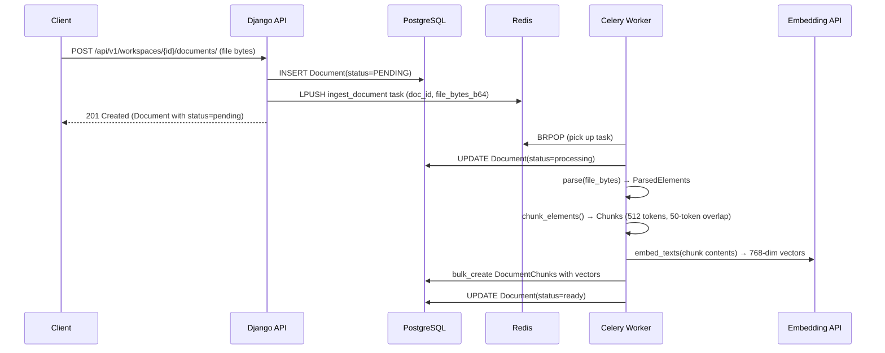
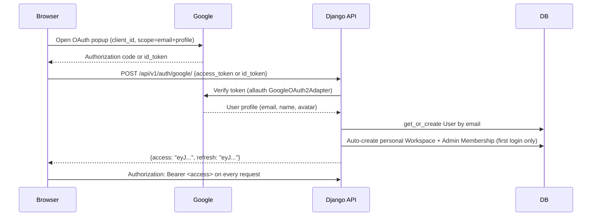

# Architecture

AskDocs is a multi-tenant RAG platform built on Django 5.0.6 + Django REST Framework 3.15.1. This document explains how the system is structured, how requests flow through it, and why the major design decisions were made.

## Layered Architecture Overview

Every request moves through four clearly separated layers:

```
HTTP Request
    │
    ▼
Views (apps/*/views.py)        — thin; validate auth, extract IDs, delegate immediately
    │
    ▼
Serializers (apps/*/serializers.py)  — validation and shape transformation only
    │
    ▼
Services (apps/*/services.py)  — all business logic lives here; no HTTP concepts
    │
    ▼
Models (apps/*/models.py)      — data definition, constraints, simple properties
    │
    ▼
PostgreSQL + pgvector
```

**Views are thin** — a view's job is to authenticate, parse the URL, call a service, and return a response. No business logic belongs in a view.

**Serializers handle validation and shape** — they don't call services or contain decision logic. They translate between HTTP payloads and validated Python dicts.

**Services own business logic** — if something is more than a database lookup, it lives in a service function. Services are easier to unit-test and can be called from tasks, management commands, or tests without spinning up an HTTP stack.

**Models own data** — the models define the schema, constraints, and indexes. They expose simple properties and `__str__` methods. Complex queries live in services.

## Multi-Tenancy Strategy

Every resource in AskDocs belongs to exactly one `Workspace`. Isolation is enforced at three layers:

### Layer 1 — Permission classes (view layer)

`IsWorkspaceMember`, `IsWorkspaceAdmin`, and `IsWorkspaceMemberOrAdmin` in `apps/core/permissions.py` check that `request.user` has a `Membership` for the workspace referenced in the URL before any view logic runs.

```python
class IsWorkspaceMember(BasePermission):
    def has_permission(self, request, view):
        workspace_id = view.kwargs.get("pk") or view.kwargs.get("workspace_id")
        return Membership.objects.filter(
            workspace_id=workspace_id, user=request.user
        ).exists()
```

A 403 is raised here before the queryset is touched.

### Layer 2 — WorkspaceScopedQuerysetMixin (queryset layer)

`WorkspaceScopedQuerysetMixin` in `apps/core/mixins.py` filters every queryset to `workspace_id` from the URL (or `X-Workspace-Id` header). Even if a permission check were somehow bypassed, queries would still return empty results for resources belonging to a different workspace.

```python
class WorkspaceScopedQuerysetMixin:
    """Filters a ViewSet queryset to the workspace in the URL or X-Workspace-Id header."""

    def _get_workspace_id(self) -> str | None:
        kwargs = getattr(self, "kwargs", {})
        return kwargs.get("workspace_id") or self.request.META.get("HTTP_X_WORKSPACE_ID")

    def get_queryset(self):
        qs = super().get_queryset()
        workspace_id = self._get_workspace_id()
        if not workspace_id:
            return qs.none()
        if not Membership.objects.filter(
            workspace_id=workspace_id, user=self.request.user
        ).exists():
            return qs.none()
        return qs.filter(workspace_id=workspace_id)
```

### Layer 3 — Denormalized `workspace_id` on child models

`DocumentChunk` and `Message` both carry a direct `workspace` FK, even though they could derive it through `Document → workspace` and `Conversation → workspace`. This denormalization means workspace-scoped vector searches and message queries never need an extra join — and it adds defense-in-depth if a parent relationship were ever corrupted.

See [auth-and-multi-tenancy.md](auth-and-multi-tenancy.md) for the full security model.

## Async Processing Architecture

Document ingestion is synchronous parsing + embedding work that takes 5–60 seconds depending on file size and parser strategy. Running this synchronously would block API workers and time out clients, so it runs as a Celery task.



**Why Celery?** It decouples processing time from HTTP response time. The API responds in milliseconds; the worker takes as long as it needs.

**Why Redis?** It's the simplest reliable message broker for Celery, already in the stack for rate-limit caching. Database 1 (`redis://redis:6379/1`) is the Celery broker; database 0 (`redis://redis:6379/0`) is the Django cache backend.

**Task retries:** `ingest_document` is declared with `max_retries=3` and a 60-second countdown between retries. On unrecoverable failure, the Document is marked `FAILED` with the error message stored in `Document.error_message`.

## Provider Abstraction Pattern

Every external AI integration — LLM completion, streaming, and connection testing — goes through the same abstraction:

```python
# apps/providers/llm/base.py
class BaseLLMProvider(ABC):
    provider_name: str
    supports_streaming: bool = False

    @abstractmethod
    def test_connection(self) -> ProviderTestResult: ...

    @abstractmethod
    def complete(self, messages: list[Message], **kwargs) -> CompletionResult: ...

    @abstractmethod
    def stream(self, messages: list[Message], **kwargs) -> Iterator[StreamChunk]: ...
```

Concrete implementations (`OpenAIProvider`, `GeminiProvider`, `AnthropicProvider`, `AzureProvider`, `MistralProvider`, `GroqProvider`, `OllamaProvider`) live in `apps/providers/llm/`. They are registered in `PROVIDER_REGISTRY`:

```python
PROVIDER_REGISTRY = {
    "openai": OpenAIProvider,
    "anthropic": AnthropicProvider,
    "gemini": GeminiProvider,
    "azure": AzureProvider,
    "mistral": MistralProvider,
    "groq": GroqProvider,
    "ollama": OllamaProvider,
}
```

`get_llm_provider_for_workspace(workspace)` looks up the workspace's `ProviderConfig`, instantiates the right class, and returns it. If no config exists, it returns `PlatformDefaultProvider` (which wraps Gemini or OpenAI using the platform's own API key).

The same pattern applies to embedding providers (`BaseEmbeddingProvider` → `OpenAIEmbeddingProvider` / `GeminiEmbeddingProvider`) and parser providers (`BaseParserProvider` → `UnstructuredParserProvider` / `PypdfParserProvider`).

## State Machine: Document Lifecycle

```
 ┌──────────┐   API creates row    ┌────────────┐
 │  PENDING │ ─────────────────► │  PROCESSING │
 └──────────┘                    └────────────┘
                                       │
                         ┌─────────────┴──────────────┐
                         │                            │
                         ▼                            ▼
                    ┌─────────┐                 ┌─────────┐
                    │  READY  │                 │  FAILED │
                    └─────────┘                 └─────────┘
```

| Transition | Trigger | Location |
|---|---|---|
| PENDING → PROCESSING | Worker picks up task | `ingest_document` task start |
| PROCESSING → READY | All chunks embedded and persisted | `ingest_document` task end |
| PROCESSING → FAILED | Any unrecoverable exception (after 3 retries) | `ingest_document` except block |

The `error_message` field on `Document` stores the exception string on FAILED transitions for debugging.

## Authentication Flow



JWT settings (from `config/settings/base.py`):
- Access token lifetime: **60 minutes**
- Refresh token lifetime: **7 days**
- Refresh tokens rotate on use (`ROTATE_REFRESH_TOKENS=True`)
- Old refresh tokens are blacklisted (`BLACKLIST_AFTER_ROTATION=True`)
- Signing key: `JWT_SIGNING_KEY` env var (separate from Django's `SECRET_KEY`)

See [auth-and-multi-tenancy.md](auth-and-multi-tenancy.md) for the full auth deep-dive.

## Request Lifecycle: Chat Message

When a `POST /api/v1/workspaces/{workspace_id}/conversations/{conversation_id}/messages/` arrives, here is every file the request touches in order:

1. `config/urls.py` — routes to `api/v1/`
2. `config/api_v1_urls.py` — matches `MessageStreamView`
3. `apps/core/permissions.py:IsWorkspaceMemberOrAdmin` — verifies JWT and membership
4. `apps/chat/views.py:MessageStreamView.post` — validates `SendMessageSerializer`, extracts `content` and `top_k`
5. `apps/chat/services.py:stream_chat_response` — orchestrates the full pipeline:
   a. `apps/chat/limits.py:check_and_increment_user_limit` — Redis incr on `chat:user:{user_id}:{date}`
   b. `apps/chat/limits.py:check_and_increment_global_budget` — Redis incr on `chat:global_budget:{date}` (platform-default only)
   c. `apps/chat/models.py:Message` — persists user message to DB
   d. `apps/chat/retrieval.py:retrieve_chunks_for_query` — embeds query, pgvector cosine search
   e. `apps/chat/cache.py:cache_key_for_query` — sha256 of workspace + chunk IDs + normalized query
   f. `apps/chat/cache.py:get_cached_response` — Redis lookup; if hit, stream cached text and return
   g. `apps/chat/prompts.py:build_rag_prompt` — assembles system prompt + chunk context + history
   h. `apps/providers/services.py:get_active_provider` — resolves BYOK config or platform default
   i. `provider.stream(messages)` — yields `StreamChunk` objects from the LLM
   j. `apps/chat/models.py:Message` — persists assistant message with citations and chunk snapshot
   k. `apps/chat/cache.py:cache_response` — stores full response in Redis with 24h TTL
6. `apps/chat/views.py` — yields each event as `event: {type}\ndata: {json}\n\n` SSE format
7. `django.http.StreamingHttpResponse` — streams response to client

## Cost Guardrails

| Guardrail | Implementation | Location |
|---|---|---|
| Per-user daily message limit | Redis incr, default 100/day | `apps/chat/limits.py:check_and_increment_user_limit` |
| Global platform budget | Redis incr, default 5000/day | `apps/chat/limits.py:check_and_increment_global_budget` |
| Response caching | 24h Redis cache keyed by (workspace + chunks + query) | `apps/chat/cache.py` |
| Provider test rate limit | 10 tests/hour per workspace | `apps/providers/rate_limit.py` |
| BYOK bypass | BYOK workspaces skip the global budget check | `apps/chat/services.py:_is_using_platform_default` |

The global budget only applies to workspaces using the platform's default LLM key — BYOK workspaces pay their own API bill and are exempt.

## Security Posture

| Concern | Defense |
|---|---|
| BYOK API key exposure | Fernet symmetric encryption at rest; raw key never stored; only last 4 digits stored in plaintext for display |
| JWT theft | 60-minute access token expiry; refresh tokens rotate and blacklist on use |
| Workspace data isolation | Three-layer enforcement: permission class + queryset mixin + denormalized workspace_id |
| CORS | `django-cors-headers` restricts origins to `CORS_ALLOWED_ORIGINS` env list |
| IDOR | WorkspaceScopedQuerysetMixin returns empty queryset (not 404/403) for non-members, preventing enumeration |
| Secrets in code | All secrets in environment variables; `.env.example` has no real values |
| HSTS | `SECURE_HSTS_SECONDS=31536000` enforced in production settings |

---

**What's next:** [data-model.md](data-model.md) — the complete database schema.
