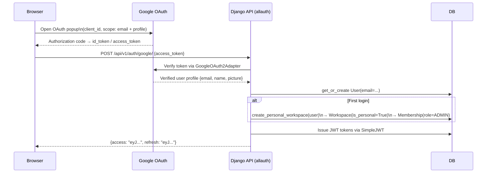

# Auth & Multi-Tenancy

This document covers how users authenticate, how JWTs work, and how workspace isolation is enforced at every layer.

## The Google OAuth Flow

AskDocs uses Google as the only identity provider. There is no username/password login.



**Implementation:**
- `GoogleLoginView` in `apps/accounts/views.py` extends dj-rest-auth's `SocialLoginView` with `adapter_class=GoogleOAuth2Adapter` and `callback_url="postmessage"`.
- allauth validates the token with Google, then creates or retrieves the `User` row.
- dj-rest-auth wraps SimpleJWT to mint the access + refresh pair.
- A `post_save` signal (or allauth adapter hook) triggers `create_personal_workspace` from `apps/workspaces/services.py` on first login.

**Settings** (`config/settings/base.py`):
```python
ACCOUNT_AUTHENTICATION_METHOD = "email"
ACCOUNT_USERNAME_REQUIRED = False
ACCOUNT_EMAIL_REQUIRED = True
ACCOUNT_EMAIL_VERIFICATION = "none"

SOCIALACCOUNT_PROVIDERS = {
    "google": {
        "APP": {
            "client_id": env("GOOGLE_OAUTH_CLIENT_ID"),
            "secret": env("GOOGLE_OAUTH_CLIENT_SECRET"),
        },
        "SCOPE": ["profile", "email"],
        "AUTH_PARAMS": {"access_type": "online"},
    }
}
```

## JWT Lifecycle

**Token settings** (`config/settings/base.py`):
```python
SIMPLE_JWT = {
    "ACCESS_TOKEN_LIFETIME": timedelta(minutes=60),
    "REFRESH_TOKEN_LIFETIME": timedelta(days=7),
    "ROTATE_REFRESH_TOKENS": True,
    "BLACKLIST_AFTER_ROTATION": True,
    "SIGNING_KEY": env("JWT_SIGNING_KEY"),
    "AUTH_HEADER_TYPES": ("Bearer",),
    "USER_ID_FIELD": "id",
    "USER_ID_CLAIM": "user_id",
}
```

**Access token** — valid for 60 minutes. Sent in `Authorization: Bearer <token>` on every request. Short-lived to limit the damage if a token leaks.

**Refresh token** — valid for 7 days. Used only at `POST /api/v1/auth/token/refresh/`. On each use:
1. The old refresh token is **blacklisted** (stored in `rest_framework_simplejwt.token_blacklist`).
2. A new refresh token is issued.
3. A new access token is issued.

This means a stolen refresh token can only be used once before it's blacklisted.

**Logout** — `POST /api/v1/auth/logout/` blacklists the provided refresh token immediately, ending the session.

**Signing key** — `JWT_SIGNING_KEY` is a separate env var from Django's `SECRET_KEY`. Rotating one doesn't invalidate the other.

## User → Workspace → Membership

The core data model for tenancy:

```
User ──< Membership >── Workspace
              │
           role: ADMIN | MEMBER | VIEWER
```

A `User` can belong to multiple workspaces. Each workspace membership carries exactly one role. There is no global role — roles are always relative to a specific workspace.

**Personal workspace:** Every user gets one workspace with `is_personal=True`. This is created automatically on first login. Personal workspaces cannot be deleted (the API raises `CannotDeletePersonalWorkspace`).

## The Three Roles

| Action | ADMIN | MEMBER | VIEWER |
|---|:---:|:---:|:---:|
| View workspace members | ✅ | ✅ | ✅ |
| Send chat messages | ✅ | ✅ | ❌ |
| Create/delete conversations | ✅ | ✅ | ❌ |
| Upload documents | ✅ | ✅ | ❌ |
| View documents | ✅ | ✅ | ✅ |
| Invite new members | ✅ | ❌ | ❌ |
| Change member roles | ✅ | ❌ | ❌ |
| Remove members | ✅ | ❌ | ❌ |
| Configure BYOK provider | ✅ | ❌ | ❌ |
| Test provider connection | ✅ | ❌ | ❌ |
| Delete workspace | ✅ | ❌ | ❌ |

**Permission classes** in `apps/core/permissions.py`:
- `IsWorkspaceMember` — any of ADMIN, MEMBER, VIEWER
- `IsWorkspaceAdmin` — ADMIN only
- `IsWorkspaceMemberOrAdmin` — ADMIN or MEMBER (blocks VIEWER from write operations)

## Workspace Isolation: Three Layers of Defense

### Layer 1 — Permission classes (HTTP layer)

Every workspace-scoped view declares a permission class:

```python
class MessageStreamView(APIView):
    permission_classes = [IsWorkspaceMemberOrAdmin]
```

The permission class checks `Membership.objects.filter(workspace_id=..., user=request.user).exists()` before any view logic runs. A non-member gets a 403 immediately.

```python
class IsWorkspaceMember(BasePermission):
    def has_permission(self, request, view):
        workspace_id = (
            view.kwargs.get("pk")
            or view.kwargs.get("workspace_id")
        )
        return Membership.objects.filter(
            workspace_id=workspace_id, user=request.user
        ).exists()
```

### Layer 2 — WorkspaceScopedQuerysetMixin (queryset layer)

Viewsets that list or retrieve objects inherit `WorkspaceScopedQuerysetMixin`:

```python
class WorkspaceScopedQuerysetMixin:
    def get_queryset(self):
        qs = super().get_queryset()
        workspace_id = self._get_workspace_id()
        if not workspace_id:
            return qs.none()
        if not Membership.objects.filter(
            workspace_id=workspace_id, user=self.request.user
        ).exists():
            return qs.none()
        return qs.filter(workspace_id=workspace_id)
```

Even if the permission check were bypassed (e.g., a future bug), the queryset would still return empty results for resources belonging to other workspaces. You cannot enumerate another workspace's conversations or documents.

### Layer 3 — Denormalized `workspace_id` on child models

`DocumentChunk` and `Message` carry a direct `workspace` FK, even though it's derivable through the parent chain. This means:

1. **Workspace-scoped vector searches don't need joins** — the pgvector query filters directly on `DocumentChunk.workspace_id`.
2. **Defense in depth** — if a parent object were ever orphaned, child objects would still be correctly isolated.

## Personal Workspace Auto-Creation

When a user logs in for the first time:

1. allauth creates (or retrieves) the `User` row.
2. `create_personal_workspace(user)` in `apps/workspaces/services.py` runs:

```python
def create_personal_workspace(user) -> Workspace:
    name = (
        f"{user.first_name}'s Workspace"
        if user.first_name
        else f"{user.email.split('@')[0]}'s Workspace"
    )
    workspace = _create_workspace_with_slug(name, created_by=user, is_personal=True)
    Membership.objects.create(workspace=workspace, user=user, role=Membership.Role.ADMIN)
    return workspace
```

The workspace is named `"{first_name}'s Workspace"` or `"{email_prefix}'s Workspace"` if no name is available. The user gets `ADMIN` membership immediately.

## Common Attack Vectors and Defenses

| Attack | Defense |
|---|---|
| **IDOR** (guess another workspace's UUID) | WorkspaceScopedQuerysetMixin returns empty queryset; no 404 leaks workspace existence to non-members |
| **Privilege escalation** (MEMBER trying admin actions) | `IsWorkspaceAdmin` permission class checked at view level before any logic runs |
| **Token theft** | 60-minute access token TTL limits exposure window; refresh tokens rotate and blacklist on use |
| **Cross-workspace data leak** | Denormalized `workspace_id` on chunks and messages prevents cross-join exploits |
| **BYOK key exposure** | Fernet encryption at rest; only last 4 characters stored in plaintext |
| **Personal workspace deletion** | Hard-coded `CannotDeletePersonalWorkspace` exception in `WorkspaceViewSet.destroy` |
| **Sole admin removal** | `CannotRemoveSoleAdmin` exception prevents a workspace from being left adminless |

## Testing Isolation

The test suite includes dedicated isolation tests in `tests/test_multi_tenancy.py` that verify:
- Users cannot list another workspace's conversations
- Users cannot list another workspace's documents
- Users cannot access another workspace's provider config
- Admin actions are blocked for non-admins

See [testing.md](testing.md) for how to run the full isolation test suite.

---

**What's next:** [document-pipeline.md](document-pipeline.md) — how files become searchable vectors.
