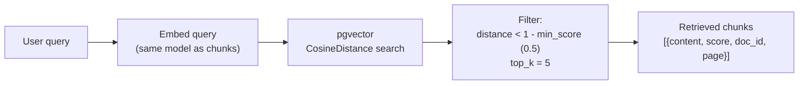
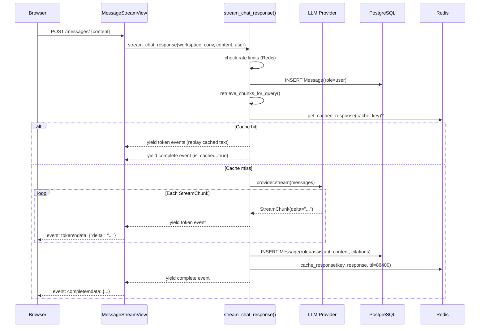

# Chat & RAG

This document explains the retrieval-augmented generation pipeline: how a user's question becomes a cited, streaming answer.

## The Retrieval Pipeline



The retrieval function is `retrieve_chunks_for_query` in `apps/chat/retrieval.py`:

```python
def retrieve_chunks_for_query(
    workspace_id: UUID,
    query: str,
    top_k: int = 5,
    min_score: float = 0.5,
) -> list[RetrievedChunk]:
    from pgvector.django import CosineDistance

    query_embedding = _embed_query(query)  # same provider as ingestion

    qs = (
        DocumentChunk.objects.filter(workspace_id=workspace_id)
        .select_related("document")
        .annotate(distance=CosineDistance("embedding", query_embedding))
        .filter(distance__lt=(1 - min_score))  # score = 1 - distance
        .order_by("distance")[:top_k]
    )
    ...
```

`score = 1 - cosine_distance`. A score of 1.0 = identical vectors; 0.5 = the threshold. Chunks with score < 0.5 are excluded.

The query is embedded with the same provider configured in `EMBEDDING_PROVIDER` (OpenAI or Gemini). Using the same embedding space for both documents and queries is required for the cosine similarity to be meaningful.

## The HNSW Index

The `DocumentChunk.embedding` field is indexed with a Hierarchical Navigable Small World (HNSW) index:

```python
HnswIndex(
    name="doc_chunk_emb_hnsw_idx",
    fields=["embedding"],
    m=16,
    ef_construction=64,
    opclasses=["vector_cosine_ops"],
)
```

**Why HNSW instead of exact search?** Exact cosine search is O(n) per query. HNSW is an approximate nearest-neighbor algorithm with O(log n) average complexity. At portfolio scale (thousands of chunks), the difference is negligible, but the index is production-ready if the corpus grows.

**Parameters:**
- `m=16` — number of connections per node. Higher = better recall, slower build.
- `ef_construction=64` — build-time search depth. Higher = better index quality, slower insert.
- `vector_cosine_ops` — pgvector operator class for cosine distance.

At query time, pgvector uses the index to find approximate nearest neighbors, then filters by the `distance__lt` condition.

## Prompt Construction

The RAG prompt is built in `apps/chat/prompts.py`:

```python
SYSTEM_PROMPT = (
    "You are AskDocs, an AI assistant that answers questions strictly based on the provided"
    " document context.\n\n"
    "Rules:\n"
    "- Answer only from the context below. If the context doesn't contain the answer, say so"
    " clearly — never make up information.\n"
    "- Cite sources inline using bracketed numbers like [1], [2], [3], matching the numbered"
    " context chunks.\n"
    "- Every claim grounded in the context must have a citation. Multiple citations are fine.\n"
    "- Keep answers concise and well-structured. Use Markdown for formatting (bold, lists,"
    " headings when useful).\n"
    "- If asked something outside the provided documents, politely refuse and suggest rephrasing.\n"
    "\n"
    "Context follows. Each chunk is numbered [N] and includes its source."
)
```

The full message list passed to the LLM:

1. `{"role": "system", "content": SYSTEM_PROMPT}`
2. Up to `CHAT_MAX_HISTORY_TURNS` (default: 6) prior messages from the conversation
3. `{"role": "user", "content": "[1] source: doc.pdf (p.12)\n{chunk_content}\n\n[2] ....\n\nQuestion: {query}"}`

Each retrieved chunk is numbered `[N]` in the user message. The LLM is instructed to cite with the same notation; the citation extractor then maps `[1]` → the first chunk's UUID.

**Conversation history** is bounded to prevent prompt bloat. The last 6 messages are included, oldest first.

## The Streaming Pipeline



**SSE event format:**
```
event: token
data: {"delta": "According to the employee "}

event: token
data: {"delta": "handbook [1], remote work..."}

event: complete
data: {
  "message_id": "ee0e8400-...",
  "citations": {"1": "ff0e8400-..."},
  "is_cached": false
}
```

The `StreamingHttpResponse` is created with `Content-Type: text/event-stream`. Each event is formatted as `f"event: {event.type}\ndata: {json.dumps(event.to_dict())}\n\n"`.

## Citation Linking

The LLM output contains inline citations like `[1]`, `[2]`. After the stream completes, the service:

1. Scans the full response text with `re.findall(r"\[(\d+)\]", text)` to find used indices.
2. Maps each index back to the corresponding `RetrievedChunk.chunk_id`.
3. Builds a `citations` dict: `{"1": "ff0e8400-...", "2": "aa0e8400-..."}`.
4. Stores both the `citations` dict and the full `retrieved_chunks` snapshot on the `Message` row.

The frontend uses `citations` to render inline links. The `GET .../messages/{id}/sources/` endpoint reads `Message.retrieved_chunks` to return the full chunk content for the sources panel.

## The Active Provider Resolver

```python
# apps/providers/services.py
def get_active_provider(workspace: Workspace) -> BaseLLMProvider:
    try:
        config = ProviderConfig.objects.get(workspace=workspace)
    except ProviderConfig.DoesNotExist:
        return PlatformDefaultProvider()
    return get_llm_provider_for_workspace(workspace)
```

**Workspace has BYOK config** → instantiate the configured provider (OpenAI, Anthropic, Gemini, etc.) using the decrypted API key.

**No config** → return `PlatformDefaultProvider`, which wraps `GeminiProvider` using `DEFAULT_PLATFORM_GEMINI_API_KEY` from the environment. (The platform default can be switched to OpenAI by setting `DEFAULT_PLATFORM_PROVIDER=openai`.)

## Rate Limiting

Rate limits are Redis-backed using Django's cache framework.

### Per-user daily limit

Redis key: `chat:user:{user_id}:{YYYY-MM-DD}` (e.g., `chat:user:550e8400-...:2026-06-01`)

```python
def check_and_increment_user_limit(user_id: UUID) -> None:
    limit = settings.USER_DAILY_MESSAGE_LIMIT  # default: 100
    key = f"chat:user:{user_id}:{date.today().isoformat()}"
    current = cache.get(key, 0)
    if current >= limit:
        raise RateLimitExceeded(...)
    cache.set(key, current + 1, timeout=86400)
```

The key expires at 86400 seconds (24 hours), resetting the counter at approximately midnight UTC.

### Global platform budget

Redis key: `chat:global_budget:{YYYY-MM-DD}` (e.g., `chat:global_budget:2026-06-01`)

```python
def check_and_increment_global_budget() -> None:
    budget = settings.GLOBAL_DAILY_PLATFORM_LLM_BUDGET  # default: 5000
    key = f"chat:global_budget:{date.today().isoformat()}"
    ...
```

**Important:** The global budget check runs **only** for workspaces using the platform default provider (`_is_using_platform_default(workspace)` returns True). BYOK workspaces are not subject to the global budget — they pay their own API bill.

**Settings:**
```
USER_DAILY_MESSAGE_LIMIT=100
GLOBAL_DAILY_PLATFORM_LLM_BUDGET=5000
```

## Response Caching

Identical queries against identical document sets return cached responses, saving LLM API costs.

**Cache key construction** (`apps/chat/cache.py`):
```python
def cache_key_for_query(workspace_id, chunk_ids, query):
    normalized = re.sub(r"\s+", " ", query.lower().strip())
    sorted_ids = sorted(str(cid) for cid in chunk_ids)
    combined = f"{workspace_id}:{':'.join(sorted_ids)}:{normalized}"
    return f"chat:cache:{hashlib.sha256(combined.encode()).hexdigest()}"
```

The key encodes:
- `workspace_id` — scopes the cache to the workspace (different workspaces with the same docs don't share cache entries)
- `sorted_ids` — the set of retrieved chunk UUIDs (sorted for determinism)
- `normalized_query` — lowercased, whitespace-normalized query text

**TTL:** `CHAT_RESPONSE_CACHE_TTL_SECONDS` env var, default `86400` (24 hours).

**What's cached:** The full response text, citations map, provider name, model name, and token counts.

**Cache hit behavior:** The full cached text is replayed as streaming token events (80 characters per event) so the client experience is identical to a live stream, just much faster.

## Failure Modes

| Failure | Behavior |
|---|---|
| **Provider auth failure** | `ProviderAuthError` → SSE `error` event `{code: "provider_auth_error"}`; assistant `Message` row saved with `error_message` |
| **Provider rate limited** | `ProviderRateLimitError` → SSE `error` event `{code: "provider_rate_limited"}`; message saved |
| **Provider timeout** | `ProviderTimeoutError` → SSE `error` event `{code: "provider_timeout"}`; message saved |
| **No relevant chunks** | Query returns 0 chunks (all below min_score); LLM receives empty context; responds "no information available" |
| **User rate limit hit** | `RateLimitExceeded` before streaming starts → HTTP 429 (not SSE) |
| **Global budget hit** | `BudgetExceeded` before streaming starts → HTTP 429 (not SSE) |

---

**What's next:** [byok-providers.md](byok-providers.md) — the bring-your-own-key provider system.
