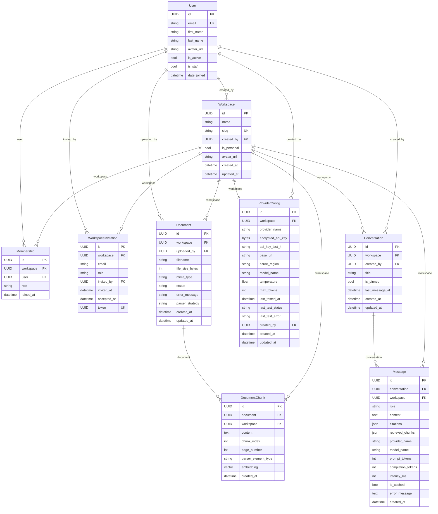

# Data Model

This document describes every database model in AskDocs, their fields, relationships, and indexes. All models inherit from `apps.core.models.BaseModel` unless noted.

## ER Diagram



## BaseModel

`apps/core/models.py` — abstract base class inherited by all primary models.

| Field | Type | Notes |
|---|---|---|
| `id` | `UUIDField` | Primary key, `default=uuid.uuid4`, not editable |
| `created_at` | `DateTimeField` | Set on insert (`auto_now_add=True`) |
| `updated_at` | `DateTimeField` | Updated on every save (`auto_now=True`) |

---

## User

`apps/accounts/models.py` — custom user model extending `AbstractBaseUser` + `PermissionsMixin`. Email is the login identifier; no username field.

| Field | Type | Constraints | Purpose |
|---|---|---|---|
| `id` | `UUIDField` | PK, `default=uuid.uuid4` | Stable identifier safe to expose in URLs |
| `email` | `EmailField` | `unique=True` | Login identifier; normalized on save |
| `first_name` | `CharField(150)` | blank | Display name |
| `last_name` | `CharField(150)` | blank | Display name |
| `avatar_url` | `TextField` | blank | Google profile picture URL |
| `is_active` | `BooleanField` | default `True` | Soft-disable without deletion |
| `is_staff` | `BooleanField` | default `False` | Django admin access |
| `date_joined` | `DateTimeField` | `auto_now_add` | Audit trail |

**Relationships:**
- Has many `Membership` rows (one per workspace the user belongs to)
- Has many `created_workspaces` (Workspace FK)
- Has many `uploaded_documents` (Document FK, `SET_NULL` on delete)
- Has many `conversations` (Conversation FK, `SET_NULL` on delete)

**Manager:** `UserManager` overrides `create_user` (normalizes email, hashes password) and `create_superuser`.

**Settings hooks:**
```python
AUTH_USER_MODEL = "accounts.User"
ACCOUNT_AUTHENTICATION_METHOD = "email"
ACCOUNT_USERNAME_REQUIRED = False
```

**Personal workspace:** Created automatically on first login via a `post_save` signal or allauth adapter. The workspace is named `"{first_name}'s Workspace"` (or `"{email_prefix}'s Workspace"`) with `is_personal=True` and an ADMIN Membership.

---

## Workspace

`apps/workspaces/models.py` — a tenant boundary. All documents, conversations, and provider configs belong to exactly one workspace.

| Field | Type | Constraints | Purpose |
|---|---|---|---|
| `id` | `UUIDField` | PK | |
| `name` | `CharField(255)` | | Display name |
| `slug` | `SlugField(255)` | `unique=True` | URL-safe identifier; auto-generated with random suffix to avoid collisions |
| `created_by` | `ForeignKey(User)` | `SET_NULL, null=True` | Audit; creator may later be removed |
| `is_personal` | `BooleanField` | default `False` | Personal workspaces cannot be deleted |
| `avatar_url` | `TextField` | blank | Workspace icon URL |
| `created_at` | inherited | | |
| `updated_at` | inherited | | |

**Relationships:**
- Has many `Membership` rows (`related_name="memberships"`)
- Has many `Document` rows (`related_name="documents"`)
- Has many `Conversation` rows (`related_name="conversations"`)
- Has one `ProviderConfig` (`OneToOneField`, `related_name="provider_config"`)

**Slug generation:** `_generate_slug(name)` creates `{slugified_name}-{6_random_chars}`. Retries up to 5 times on `IntegrityError`.

---

## Membership

`apps/workspaces/models.py` — join table between `User` and `Workspace`, carrying a `role`.

| Field | Type | Constraints | Purpose |
|---|---|---|---|
| `id` | `UUIDField` | PK | |
| `workspace` | `ForeignKey(Workspace)` | `CASCADE` | |
| `user` | `ForeignKey(User)` | `CASCADE` | |
| `role` | `CharField(10)` | choices: `ADMIN`, `MEMBER`, `VIEWER` | Controls permissions |
| `joined_at` | `DateTimeField` | `auto_now_add` | |

**Constraints:** `unique_together = [("workspace", "user")]` — one membership per (workspace, user) pair.

**Roles:**
- `ADMIN` — full control: manage members, configure providers, manage documents, chat
- `MEMBER` — read + write: upload documents, chat, create conversations
- `VIEWER` — read only: view documents and conversations; cannot chat or upload

---

## WorkspaceInvitation

`apps/workspaces/models.py` — a pending invitation to join a workspace. Accepted when the invitee hits the accept endpoint.

| Field | Type | Constraints | Purpose |
|---|---|---|---|
| `id` | `UUIDField` | PK | |
| `workspace` | `ForeignKey(Workspace)` | `CASCADE` | |
| `email` | `EmailField` | | Invitee's email |
| `role` | `CharField(10)` | choices: same as Membership.Role | Role to grant on accept |
| `invited_by` | `ForeignKey(User)` | `CASCADE` | Admin who sent the invite |
| `invited_at` | `DateTimeField` | `auto_now_add` | |
| `accepted_at` | `DateTimeField` | `null=True, blank=True` | Null = pending; set on acceptance |
| `token` | `UUIDField` | `unique=True`, `default=uuid.uuid4` | Included in the accept URL |

**Constraints:** `unique_together = [("workspace", "email")]` — one pending invite per (workspace, email).

**Accept flow:** `POST /api/v1/invitations/{token}/accept/` — finds the invitation by token, creates a Membership for `request.user` with the invitation's role, sets `accepted_at=now()`.

---

## Document

`apps/documents/models.py` — represents a file uploaded for a workspace. The file bytes are not stored in the database; they are passed to the Celery task and then stored on disk (dev) or object storage (production).

| Field | Type | Constraints | Purpose |
|---|---|---|---|
| `id` | `UUIDField` | PK | |
| `workspace` | `ForeignKey(Workspace)` | `CASCADE` | Tenant isolation |
| `uploaded_by` | `ForeignKey(User)` | `SET_NULL, null=True` | Audit; safe if user is deleted |
| `filename` | `CharField(255)` | | Original filename |
| `file_size_bytes` | `PositiveIntegerField` | default `0` | For display |
| `mime_type` | `CharField(100)` | blank | Used to select parser |
| `status` | `CharField(20)` | choices: `pending`, `processing`, `ready`, `failed` | Lifecycle state machine |
| `error_message` | `TextField` | blank | Exception text on FAILED |
| `parser_strategy` | `CharField(20)` | null, blank; choices: `fast`, `hi_res`, `auto` | Per-document override; null = use `UNSTRUCTURED_DEFAULT_STRATEGY` env var |
| `created_at` | inherited | | |
| `updated_at` | inherited | | |

**Indexes:**
- `(workspace, status)` — list documents by workspace + filter by status
- `(workspace, created_at)` — ordered listing by creation date

**Lifecycle:** PENDING → PROCESSING → READY or FAILED. See [document-pipeline.md](document-pipeline.md).

---

## DocumentChunk

`apps/documents/models.py` — a single semantic chunk from a document, with its 768-dimensional embedding vector.

| Field | Type | Constraints | Purpose |
|---|---|---|---|
| `id` | `UUIDField` | PK | |
| `document` | `ForeignKey(Document)` | `CASCADE`, `related_name="chunks"` | Parent document |
| `workspace` | `ForeignKey(Workspace)` | `CASCADE`, `related_name="chunks"` | Denormalized for fast workspace-scoped vector queries |
| `content` | `TextField` | | The chunk text sent to the embedding model and included in the RAG prompt |
| `chunk_index` | `PositiveIntegerField` | | Order within the document |
| `page_number` | `PositiveIntegerField` | `null=True` | Original page number from parser |
| `parser_element_type` | `CharField(50)` | blank, default `""` | Element type from parser: `Title`, `NarrativeText`, `Table`, `ListItem`, etc. |
| `embedding` | `VectorField(dimensions=768)` | required | Embedding vector (OpenAI `text-embedding-3-small` or Gemini `text-embedding-004`) |
| `created_at` | `DateTimeField` | `auto_now_add` | |

**Indexes:**
- `(workspace)` — filter chunks by workspace (used in retrieval)
- `(document, chunk_index)` — retrieve chunks in order
- `HnswIndex(name="doc_chunk_emb_hnsw_idx", fields=["embedding"], m=16, ef_construction=64, opclasses=["vector_cosine_ops"])` — approximate nearest-neighbor search using cosine distance

The HNSW index is managed by pgvector's Django integration. `m=16` (max connections per node) and `ef_construction=64` (construction time accuracy) are pgvector defaults, appropriate for a portfolio-scale dataset. See [chat-and-rag.md](chat-and-rag.md) for how retrieval uses this index.

---

## ProviderConfig

`apps/providers/models.py` — a workspace's bring-your-own-key LLM configuration. OneToOne with `Workspace` — each workspace has at most one active provider config.

| Field | Type | Constraints | Purpose |
|---|---|---|---|
| `id` | `UUIDField` | PK | |
| `workspace` | `OneToOneField(Workspace)` | `CASCADE`, `related_name="provider_config"` | One config per workspace |
| `provider_name` | `CharField(20)` | choices: `openai`, `anthropic`, `gemini`, `azure`, `mistral`, `groq`, `ollama` | Selects the implementation class |
| `encrypted_api_key` | `BinaryField` | `null=True` | Fernet-encrypted API key; null for Ollama (no key needed) |
| `api_key_last_4` | `CharField(4)` | blank | Last 4 chars of the plaintext key, for display only |
| `base_url` | `URLField` | `null=True` | Required for Azure and Ollama |
| `azure_region` | `CharField(100)` | `null=True` | Azure deployment region |
| `model_name` | `CharField(255)` | | e.g. `gpt-4o`, `claude-3-opus-20240229` |
| `temperature` | `FloatField` | default `0.7` | LLM temperature (0.0–1.0) |
| `max_tokens` | `PositiveIntegerField` | default `2048` | Max completion tokens |
| `last_tested_at` | `DateTimeField` | `null=True` | When test connection was last run |
| `last_test_status` | `CharField(10)` | choices: `untested`, `ok`, `failed` | Last test result |
| `last_test_error` | `TextField` | blank | Error message from last failed test |
| `created_by` | `ForeignKey(User)` | `SET_NULL, null=True` | Admin who created/replaced the config |
| `created_at` | inherited | | |
| `updated_at` | inherited | | |

**Security:** `encrypted_api_key` is stored as Fernet ciphertext (bytes). The decryption key lives in `PROVIDER_ENCRYPTION_KEY` environment variable. The raw API key never appears in the database or logs. See [byok-providers.md](byok-providers.md).

---

## Conversation

`apps/chat/models.py` — a named container for a sequence of messages in a workspace.

| Field | Type | Constraints | Purpose |
|---|---|---|---|
| `id` | `UUIDField` | PK | |
| `workspace` | `ForeignKey(Workspace)` | `CASCADE`, `related_name="conversations"` | Tenant isolation |
| `created_by` | `ForeignKey(User)` | `SET_NULL, null=True` | Owner |
| `title` | `CharField(200)` | default `"New conversation"` | Display name; can be updated |
| `is_pinned` | `BooleanField` | default `False` | UI sorting |
| `last_message_at` | `DateTimeField` | `null=True, db_index=True` | Updated on each message; used for ordering |
| `created_at` | inherited | | |
| `updated_at` | inherited | | |

**Ordering:** `["-last_message_at", "-created_at"]` — most recently active conversations first.

**Indexes:**
- `(workspace)` — list conversations by workspace
- `(last_message_at)` — covered by `db_index=True`

---

## Message

`apps/chat/models.py` — a single turn in a conversation. Stores full metadata for observability and citation display.

| Field | Type | Constraints | Purpose |
|---|---|---|---|
| `id` | `UUIDField` | PK | |
| `conversation` | `ForeignKey(Conversation)` | `CASCADE`, `related_name="messages"` | |
| `workspace` | `ForeignKey(Workspace)` | `CASCADE`, `related_name="messages"` | Denormalized for fast workspace-scoped queries |
| `role` | `CharField(20)` | choices: `user`, `assistant`, `system` | Turn type |
| `content` | `TextField` | | Full message text |
| `citations` | `JSONField` | default `[]` | List of `{index, chunk_id, document_id, document_filename, page_number, score}` |
| `retrieved_chunks` | `JSONField` | default `[]` | Snapshot of the retrieved chunks at query time (for sources endpoint) |
| `provider_name` | `CharField(50)` | blank | LLM provider used (`openai`, `gemini`, etc.) |
| `model_name` | `CharField(100)` | blank | Model name used |
| `prompt_tokens` | `PositiveIntegerField` | `null=True` | Prompt token count if reported by provider |
| `completion_tokens` | `PositiveIntegerField` | `null=True` | Completion token count if reported |
| `latency_ms` | `PositiveIntegerField` | `null=True` | Wall-clock time from first token to last |
| `is_cached` | `BooleanField` | default `False` | True if response was served from Redis cache |
| `error_message` | `TextField` | blank | Non-empty if provider returned an error |
| `created_at` | `DateTimeField` | `auto_now_add` | |

**Indexes:**
- `(conversation, created_at)` — retrieve messages in order for a conversation
- `(workspace)` — workspace-scoped message queries

**Ordering:** `["created_at"]` — chronological.

---

**What's next:** [api-reference.md](api-reference.md) — every endpoint documented with curl examples.
