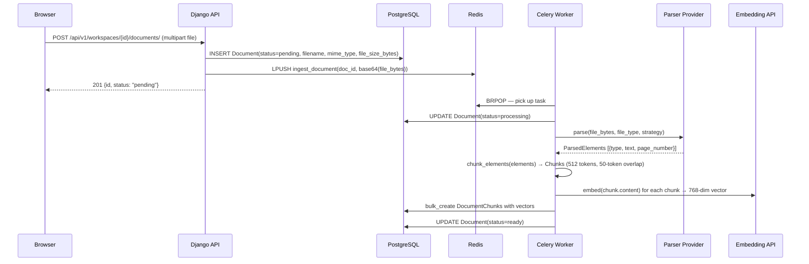

# Document Pipeline

This document explains how a file goes from user upload to a searchable, embeddable knowledge base. The pipeline runs asynchronously via Celery so the HTTP response returns in milliseconds while the actual work happens in the background.

## The Lifecycle in 10 Steps



The file bytes are base64-encoded before being placed on the Celery task queue so they survive JSON serialization.

**Note:** The REST API for document upload/list/delete is planned for Phase 6. The pipeline (models + Celery task + parsing + chunking + embedding) is complete. Currently documents can be created directly in the Django shell for testing.

## Parser Provider Details

The parser provider is selected by the `PARSER_PROVIDER` env var (default: `unstructured`). The factory in `apps/documents/parsing/factory.py` returns the right implementation.

### UnstructuredParserProvider

Uses the `unstructured` library to extract structured elements from PDF, DOCX, and TXT files. Returns typed elements rather than a flat text blob:

- `Title` — section headings
- `Header` / `Footer` — page-level metadata
- `NarrativeText` — body paragraphs
- `Table` — tabular data (HTML string)
- `ListItem` — bullet points
- `PageBreak` — skipped during chunking

**Strategies:**
- `fast` (default) — pdfminer-based, no ML models, suitable for most clean PDFs. Fast enough for production.
- `hi_res` — uses Detectron2 + PyTorch for layout analysis. Requires the `[local-inference]` extras (+2GB). Much better on scanned documents, complex layouts, and figures.
- `auto` — unstructured's internal heuristic; picks fast or hi_res per document.

**Strategy selection precedence:**
1. `Document.parser_strategy` (per-document override, set at upload time)
2. `UNSTRUCTURED_DEFAULT_STRATEGY` env var (default: `"fast"`)

### PypdfParserProvider

Lightweight fallback using pypdf. Only handles PDFs. Extracts text page-by-page with no structural element typing — all output is `NarrativeText`. Useful in environments where the unstructured library is too heavy.

### SimpleProvider (plain text)

For `.txt` files — splits by double-newline into paragraphs and wraps each in a `NarrativeText` element.

## Chunking Strategy

`apps/documents/chunking.py` converts `ParsedElement` lists into `Chunk` objects.

**Constants:**
```python
_CHUNK_MAX_TOKENS = 512       # Max tokens per prose chunk
_CHUNK_OVERLAP_TOKENS = 50    # Token overlap between adjacent prose chunks
_TABLE_MAX_TOKENS = 2000      # Tables larger than this get split
```

**Encoding:** `tiktoken.get_encoding("cl100k_base")` — same tokenizer as `text-embedding-3-small` and GPT-4.

**Rules:**

| Element type | Handling |
|---|---|
| `Title`, `Header` | Flush pending prose → start a new semantic boundary with the title as the first chunk |
| `NarrativeText`, `ListItem` | Accumulate into a prose buffer; split at 512 tokens with 50-token overlap |
| `Table` | Keep whole if ≤ 2000 tokens; split by tokens if larger; all sub-chunks preserve `element_type="Table"` |
| `PageBreak` | Skipped entirely |

The 50-token overlap prevents a sentence from being split across chunk boundaries, which would degrade retrieval quality for long paragraphs.

Each `Chunk` carries `content`, `element_type`, and `page_number` (preserved from the parser output).

## Embedding Provider Details

`apps/documents/embeddings/factory.py` returns the configured provider:

```python
EMBEDDING_PROVIDER = "openai"   # or "gemini"
```

### OpenAIEmbeddingProvider

- **Model:** `text-embedding-3-small`
- **Dimensions:** 768 (Matryoshka truncation via `dimensions=768` parameter)
- **Why 768?** It matches the existing `VectorField(dimensions=768)`. OpenAI's Matryoshka embedding lets us truncate from 1536 to 768 dimensions without a schema migration and with minimal quality loss.

### GeminiEmbeddingProvider

- **Model:** `models/text-embedding-004`
- **Dimensions:** 768 (native output size)
- **Task type:** `retrieval_query` for query embedding; `retrieval_document` for chunk embedding (improves retrieval accuracy with asymmetric embeddings).

Both providers produce 768-dimensional float vectors. The HNSW index expects cosine distance (`vector_cosine_ops`), which is why vectors should be unit-normalized. Both `text-embedding-3-small` and `text-embedding-004` produce approximately unit vectors.

## Storage

**Development:** File bytes are passed directly to the Celery task in memory (base64-encoded). No disk persistence after the task completes.

**Production (Phase 6):** Files will be stored in Supabase Storage before the task is dispatched, and the task will retrieve them from there. This decouples file storage from task queue reliability.

## Idempotency and Retry Behavior

The `ingest_document` task is declared with `max_retries=3` and a 60-second retry countdown:

```python
@shared_task(bind=True, max_retries=3)
def ingest_document(self, document_id: str, file_bytes_b64: str) -> None:
    ...
    except Exception as exc:
        doc.status = Document.Status.FAILED
        doc.error_message = f"Unexpected error: {exc}"
        doc.save(update_fields=["status", "error_message"])
        raise self.retry(exc=exc, countdown=60)
```

If the task crashes mid-ingestion (e.g., after writing some chunks but before marking READY), a retry will attempt the full pipeline again. The `DocumentChunk.document` FK is `CASCADE`, so if we delete + recreate Document rows, orphaned chunks are cleaned up. In practice, retries restart from scratch and any partially-written chunks from the failed attempt are overwritten by the bulk_create.

## Failure Modes

| Failure | What happens |
|---|---|
| **Corrupt or unreadable PDF** | Parser raises `ParserProviderError`; Document marked FAILED with the error message; no retry (permanent failure) |
| **Unsupported file type** | `UnsupportedFileType` exception; Document marked FAILED immediately |
| **0 chunks produced** | Warning logged; Document marked READY (empty document is valid, just not searchable) |
| **Embedding provider rate-limited** | The embedding call raises an exception; Celery retries up to 3 times with 60s delay |
| **Embedding provider down** | Same retry behavior as rate-limited |
| **Strategy unavailable** | `ParserStrategyUnavailable` if `hi_res` is requested but unstructured inference extras aren't installed; falls back to error |

## How to Debug a Stuck Document

Check the document's current status:
```python
# In Django shell: docker compose exec web python manage.py shell
from apps.documents.models import Document
doc = Document.objects.get(id="<uuid>")
print(doc.status, doc.error_message)
```

Inspect Celery task queues:
```bash
# Active tasks
docker compose exec worker celery -A config.celery inspect active

# Reserved (queued) tasks
docker compose exec worker celery -A config.celery inspect reserved

# Tail worker logs
docker compose logs -f worker
```

Force-reset a stuck document to PENDING to trigger re-ingestion:
```python
doc.status = "pending"
doc.error_message = ""
doc.save()
# Then dispatch the task manually:
from apps.documents.tasks import ingest_document
# Note: you need the original file bytes; or modify the task to re-read from storage
```

Check chunk count:
```python
print(doc.chunks.count())
```

---

**What's next:** [chat-and-rag.md](chat-and-rag.md) — how queries become cited answers.
