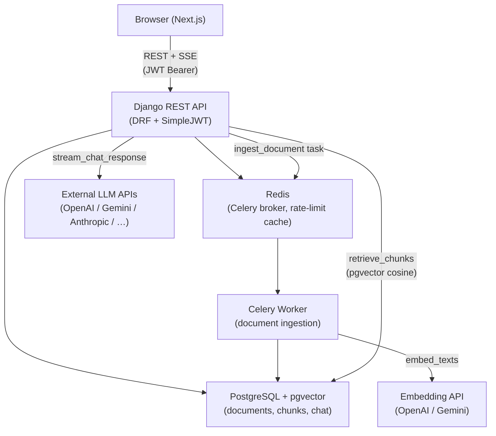

# AskDocs

AskDocs is a multi-tenant, retrieval-augmented generation (RAG) platform that lets teams upload PDF, DOCX, and TXT documents and then ask natural-language questions against them. Answers stream back in real time with inline citations pointing to the exact source chunks that grounded each claim. Every team operates in an isolated workspace; roles (Admin, Member, Viewer) control who can read, write, and configure the AI backend.

The platform is technically interesting on several fronts. The document pipeline is fully asynchronous: uploads are queued to Celery, parsed by pluggable parser providers (unstructured.io or pypdf), chunked semantically at 512-token boundaries, and embedded into a pgvector HNSW index using either OpenAI or Gemini embeddings. Retrieval uses cosine similarity in PostgreSQL — no separate vector database. The BYOK (bring-your-own-key) provider system lets each workspace connect its own LLM (OpenAI, Anthropic, Gemini, Azure, Mistral, Groq, or Ollama) with API keys encrypted at rest using Fernet symmetric encryption. Workspaces without a BYOK config fall back to a platform-default provider with per-user and global daily rate limits.

The codebase is a Django/Next.js monorepo. The backend is a 12-factor service deployable to any container host; the frontend is a Next.js 14 App Router application. Together they demonstrate the full stack of a production SaaS: multi-tenancy, async pipelines, streaming APIs, BYOK integrations, and enterprise-grade auth.

## System Architecture



**Upload flow:** Browser POSTs file → API creates `Document(status=PENDING)` → dispatches `ingest_document` Celery task via Redis → Worker parses + chunks + embeds → bulk-inserts `DocumentChunk` rows with 768-dim vectors → marks `Document(status=READY)`.

**Chat flow:** Browser POSTs message → API embeds query → pgvector cosine search (top-5 chunks, min score 0.5) → checks response cache → builds RAG prompt → streams provider tokens as SSE events → persists `Message` with citations → caches full response (24h TTL).

**Auth flow:** Browser triggers Google OAuth popup → sends `id_token` to `POST /api/v1/auth/google/` → allauth validates with Google → dj-rest-auth returns JWT access (60 min) + refresh (7 days) → Browser stores tokens → sends `Authorization: Bearer <access>` on every request.

## The 3-Minute Tour

| Document | What you'll learn |
|---|---|
| [backend/docs/architecture.md](../backend/docs/architecture.md) | Layered design, multi-tenancy, async pipeline, provider abstraction, request lifecycle |
| [backend/docs/data-model.md](../backend/docs/data-model.md) | Every database model with field tables, indexes, and an ER diagram |
| [backend/docs/api-reference.md](../backend/docs/api-reference.md) | Every endpoint with curl examples, request/response schemas, and error codes |
| [backend/docs/auth-and-multi-tenancy.md](../backend/docs/auth-and-multi-tenancy.md) | Google OAuth flow, JWT lifecycle, workspace isolation, role matrix |
| [backend/docs/document-pipeline.md](../backend/docs/document-pipeline.md) | File → chunks → vectors: parsing, chunking, embedding, failure modes |
| [backend/docs/chat-and-rag.md](../backend/docs/chat-and-rag.md) | Retrieval, prompt construction, streaming SSE, citation linking, caching |
| [backend/docs/byok-providers.md](../backend/docs/byok-providers.md) | BYOK system: encryption, provider abstraction, how to add a new provider |
| [backend/docs/setup.md](../backend/docs/setup.md) | Get the project running locally in 10 minutes |
| [backend/docs/testing.md](../backend/docs/testing.md) | Test suite, smoke-test script, manual checklists |
| [backend/docs/deployment.md](../backend/docs/deployment.md) | Target infra (Vercel + Fly.io + Supabase + Upstash) — draft for Phase 6 |
| [backend/docs/operations.md](../backend/docs/operations.md) | Runbook: common tasks, diagnostics, useful Django shell snippets |
| [docs/freelance-pitch.md](freelance-pitch.md) | Interview prep: elevator pitch, talking points, tough Q&A |

## Tech Stack

| Component | Technology | Version | Purpose |
|---|---|---|---|
| API framework | Django + DRF | 5.0.6 / 3.15.1 | REST API, ORM, admin |
| Auth | dj-rest-auth + allauth + SimpleJWT | 6.0.0 / 0.63.3 / 5.3.1 | Google OAuth, JWT |
| Database | PostgreSQL + pgvector | 15+ / 0.3.0 | Relational data + vector search |
| Task queue | Celery + Redis | 5.4.0 / 5.0.4 | Async document ingestion |
| API schema | drf-spectacular | 0.27.2 | OpenAPI 3.0 auto-docs |
| Encryption | cryptography (Fernet) | 42.0.8 | BYOK API key storage |
| Frontend | Next.js 14 App Router | 14.x | Chat UI, document manager |
| Frontend styling | Tailwind CSS + shadcn/ui | latest | Component library |
| Container runtime | Docker + docker-compose | - | Local development |

## Repository Structure

```
AskDocs/
├── backend/                    # Django REST API
│   ├── apps/
│   │   ├── accounts/           # User model, Google OAuth view, /me endpoint
│   │   ├── chat/               # Conversations, messages, RAG pipeline, limits, cache
│   │   ├── core/               # BaseModel, permissions, mixins, exceptions, health
│   │   ├── documents/          # Document/Chunk models, Celery tasks, parsing, chunking, embeddings
│   │   ├── providers/          # BYOK provider configs, LLM registry, Fernet crypto
│   │   └── workspaces/         # Workspace, Membership, Invitation models and views
│   ├── config/
│   │   ├── settings/           # base.py, development.py, production.py, testing.py
│   │   ├── api_v1_urls.py      # All /api/v1/ route definitions
│   │   ├── celery.py           # Celery app config
│   │   └── urls.py             # Root URL config (health, schema, /api/v1/)
│   ├── tests/                  # pytest test suite
│   ├── docs/                   # Technical documentation (this directory)
│   ├── docker-compose.yml      # Local dev: web, worker, db, redis
│   ├── Dockerfile              # Multi-stage image
│   ├── requirements.txt        # Production dependencies
│   └── requirements-dev.txt    # Development + test dependencies
├── frontend/                   # Next.js 14 App Router application
│   ├── app/                    # Route segments (App Router)
│   ├── components/             # React components
│   └── lib/                    # API client, utilities
├── docs/                       # Monorepo-level docs (this file, freelance-pitch.md)
├── scripts/                    # Utility scripts (smoke-test.sh)
└── docker-compose.yml          # Root-level compose (if present)
```

## Getting Started

See [backend/docs/setup.md](../backend/docs/setup.md) for the complete local setup guide.

```bash
git clone <repo>
cd AskDocs/backend
cp .env.example .env
# Edit .env — fill in GOOGLE_OAUTH_CLIENT_ID, DEFAULT_PLATFORM_OPENAI_API_KEY, PROVIDER_ENCRYPTION_KEY
docker compose up --build
```

## Project Status

**Current phase: Phase 5 (Chat + RAG)**

| Phase | Status | Description |
|---|---|---|
| 1 | ✅ Complete | Django project scaffold, Docker, CI |
| 2 | ✅ Complete | User model, Google OAuth, JWT auth |
| 3 | ✅ Complete | Workspace multi-tenancy, invitations |
| 4 | ✅ Complete | Document ingestion pipeline (models, parsing, chunking, embedding, Celery) |
| 5 | ✅ Complete | Chat + RAG (retrieval, streaming, citations, caching, rate limiting) |
| 6 | 🔲 Planned | Document REST API (upload/list/delete), production deployment (Fly.io + Supabase + Vercel) |

> **What's next:** Phase 6 adds the document upload/management API endpoints (currently the ingestion pipeline exists but no REST views), then production deployment to Fly.io (backend + worker), Supabase (Postgres + Storage), Upstash (Redis), and Vercel (frontend). See [backend/docs/deployment.md](../backend/docs/deployment.md).
